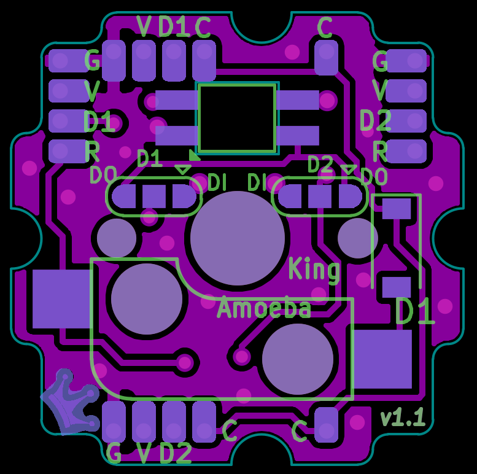

# Keyboard project notes

References:

- How matrix works - https://github.com/qmk/qmk_firmware/tree/master/keyboards/handwired/dactyl_manuform
- Amoeba King Wiring - https://wylderbuilds.com/amoeba-kings-wtf
- QMK layout - https://github.com/qmk/qmk_firmware/tree/master/keyboards/handwired/dactyl_manuform
- Amoeba King Source - https://github.com/JKing-B16/keyboard-pcb

## Amoeba king traces

## QA Procedures

### Switch Tests

1. No press, row VCC, nothing happens:
    - Assert: R = VCC
    - Expect: 
        - R = VCC
        - C = GND
1. No press, column VCC, nothing happens:
    - Assert: C = VCC
    - Expect: 
        - R = GND
        - C = VCC
1. Press, row VCC, column activates:
    - Assert: R = VCC
    - Expect: 
        - R = VCC
        - C = VCC
1. Press, column VCC, nothing happens:
    - Assert: C = VCC
    - Expect: 
        - R = GND
        - C = VCC

### LED Tests

